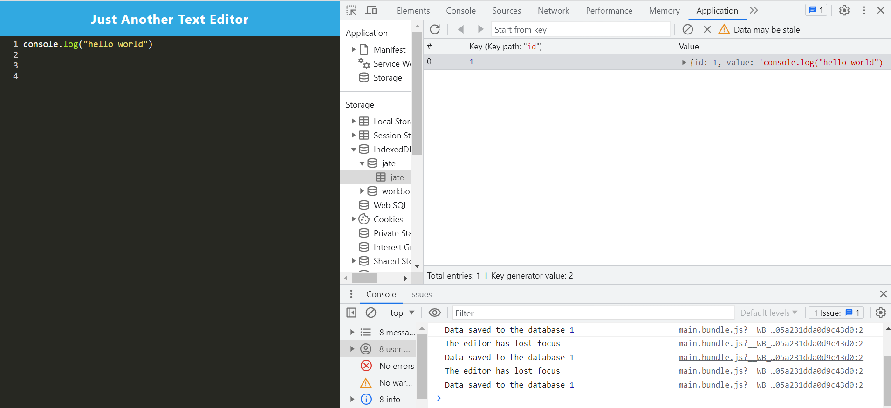

# editor-text

## Description
This PWA single-paged application is a text editor with the purpose of being able to take notes based on Javascript, specifically with syntax handling. This application utilizes various plugins within the page itself in order to produce the HTML file necessary , a manifest file with a manifest.json that will allow for functionality of the text editor while offline, as well as a service handler. 

## Usage 
Deployed editor-text image: 
editor-text heroku deployment link https://editor-text1-1323cbe08701.herokuapp.com/

## Credits
The following site assisted in basic and general JS concepts as well as how to operate JS itself using various methods and syntax: https://www.w3schools.com/js/js_syntax.asp
The following site helped with learning how to set up various JS algorithms as well as how they affected your code as a whole: https://www.freecodecamp.org/learn/javascript-algorithms-and-data-structures/#basic-javascript
The following site helped with sql functionality as well as how to update various databases: https://www.w3schools.com/sql/sql_update.asp
The following individual's github profile indicates partnership in regards to working together and collaborating/sharing constructive ideas with the password generator webpage: https://github.com/LucasWyski001

## License
MIT License

Copyright (c) 2023 drog41813

Permission is hereby granted, free of charge, to any person obtaining a copy
of this software and associated documentation files (the "Software"), to deal
in the Software without restriction, including without limitation the rights
to use, copy, modify, merge, publish, distribute, sublicense, and/or sell
copies of the Software, and to permit persons to whom the Software is
furnished to do so, subject to the following conditions:

The above copyright notice and this permission notice shall be included in all
copies or substantial portions of the Software.

THE SOFTWARE IS PROVIDED "AS IS", WITHOUT WARRANTY OF ANY KIND, EXPRESS OR
IMPLIED, INCLUDING BUT NOT LIMITED TO THE WARRANTIES OF MERCHANTABILITY,
FITNESS FOR A PARTICULAR PURPOSE AND NONINFRINGEMENT. IN NO EVENT SHALL THE
AUTHORS OR COPYRIGHT HOLDERS BE LIABLE FOR ANY CLAIM, DAMAGES OR OTHER
LIABILITY, WHETHER IN AN ACTION OF CONTRACT, TORT OR OTHERWISE, ARISING FROM,
OUT OF OR IN CONNECTION WITH THE SOFTWARE OR THE USE OR OTHER DEALINGS IN THE
SOFTWARE.